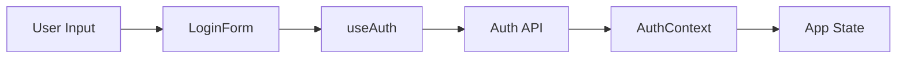

# Documentation Reference (TypeScript + React)

## Documentation Strategy

### Three Layers

1. **Code Documentation** (JSDoc) - Inline with code
2. **Component Documentation** (Storybook) - Visual examples
3. **Feature Documentation** (Markdown) - Architecture and decisions

## JSDoc Best Practices

### Documenting Components

```typescript
/**
 * A reusable button component with multiple variants and states.
 *
 * Supports primary, secondary, and danger variants. Can display
 * loading states and be disabled. Fully accessible with ARIA attributes.
 *
 * @example
 * ```tsx
 * // Primary button
 * <Button variant="primary" label="Save" onClick={handleSave} />
 *
 * // Loading state
 * <Button
 *   variant="primary"
 *   label="Saving..."
 *   isLoading={true}
 *   onClick={handleSave}
 * />
 *
 * // Disabled state
 * <Button
 *   variant="secondary"
 *   label="Cancel"
 *   isDisabled={true}
 *   onClick={handleCancel}
 * />
 * ```
 */
export function Button({ variant, label, onClick, isLoading, isDisabled }: ButtonProps) {
  // Implementation
}
```

### Documenting Hooks

```typescript
/**
 * Manages form state and validation with Zod schema.
 *
 * Provides form values, errors, and handlers for controlled inputs.
 * Automatically validates on submit and provides field-level errors.
 *
 * @template T - The shape of the form data
 * @param schema - Zod schema for validation
 * @param initialValues - Initial form values
 * @param onSubmit - Callback called with validated data on successful submit
 * @returns Form state and handlers
 *
 * @example
 * ```tsx
 * const LoginSchema = z.object({
 *   email: z.string().email(),
 *   password: z.string().min(8)
 * })
 *
 * function LoginForm() {
 *   const { values, errors, setValue, handleSubmit } = useFormValidation(
 *     LoginSchema,
 *     { email: '', password: '' },
 *     async (data) => {
 *       await api.login(data.email, data.password)
 *     }
 *   )
 *
 *   return (
 *     <form onSubmit={handleSubmit}>
 *       <Input
 *         label="Email"
 *         value={values.email}
 *         onChange={(e) => setValue('email', e.target.value)}
 *         error={errors.email}
 *       />
 *       <Input
 *         label="Password"
 *         type="password"
 *         value={values.password}
 *         onChange={(e) => setValue('password', e.target.value)}
 *         error={errors.password}
 *       />
 *       <button type="submit">Login</button>
 *     </form>
 *   )
 * }
 * ```
 */
export function useFormValidation<T>(
  schema: ZodSchema<T>,
  initialValues: T,
  onSubmit: (data: T) => Promise<void>
): UseFormValidationReturn<T> {
  // Implementation
}
```

### Documenting Types

```typescript
/**
 * Branded type for user IDs.
 *
 * Prevents accidentally passing any string as a user ID.
 * Must be created through `createUserId` validation function.
 *
 * @example
 * ```typescript
 * // ❌ Error: Type 'string' is not assignable to type 'UserId'
 * const id: UserId = "some-id"
 *
 * // ✅ Must use constructor
 * const id = createUserId("uuid-here")
 *
 * // ✅ Type-safe function parameters
 * function getUser(id: UserId): User {
 *   // id is guaranteed to be validated
 * }
 * ```
 */
export type UserId = Brand<string, 'UserId'>

/**
 * Creates a validated UserId.
 *
 * @param value - String to validate as user ID
 * @returns Branded UserId type
 * @throws {Error} If value is empty or invalid format
 *
 * @example
 * ```typescript
 * try {
 *   const id = createUserId("550e8400-e29b-41d4-a716-446655440000")
 *   // id is now UserId type
 * } catch (error) {
 *   console.error("Invalid user ID")
 * }
 * ```
 */
export function createUserId(value: string): UserId {
  if (!value || !isValidUUID(value)) {
    throw new Error(`Invalid user ID: ${value}`)
  }
  return value as UserId
}
```

## Storybook Templates

### Basic Component Story

```typescript
import type { Meta, StoryObj } from '@storybook/react'
import { Button } from './Button'

const meta: Meta<typeof Button> = {
  title: 'Components/Button',
  component: Button,
  parameters: {
    layout: 'centered',
    docs: {
      description: {
        component: 'A versatile button component with multiple variants and states.'
      }
    }
  },
  tags: ['autodocs'],
  argTypes: {
    variant: {
      control: 'select',
      options: ['primary', 'secondary', 'danger'],
      description: 'Visual style variant'
    },
    isDisabled: {
      control: 'boolean',
      description: 'Disables the button'
    }
  }
}

export default meta
type Story = StoryObj<typeof Button>

export const Default: Story = {
  args: {
    label: 'Button',
    variant: 'primary',
    onClick: () => console.log('clicked')
  }
}

export const AllVariants: Story = {
  render: () => (
    <div style={{ display: 'flex', gap: '1rem' }}>
      <Button variant="primary" label="Primary" onClick={() => {}} />
      <Button variant="secondary" label="Secondary" onClick={() => {}} />
      <Button variant="danger" label="Danger" onClick={() => {}} />
    </div>
  )
}
```

### Form Component Story

```typescript
import type { Meta, StoryObj } from '@storybook/react'
import { userEvent, within, expect } from '@storybook/test'
import { LoginForm } from './LoginForm'

const meta: Meta<typeof LoginForm> = {
  title: 'Features/Auth/LoginForm',
  component: LoginForm,
  parameters: {
    layout: 'centered'
  }
}

export default meta
type Story = StoryObj<typeof LoginForm>

export const Default: Story = {}

// Interactive story with testing
export const FilledForm: Story = {
  play: async ({ canvasElement }) => {
    const canvas = within(canvasElement)

    // Fill form
    await userEvent.type(canvas.getByLabelText(/email/i), 'test@example.com')
    await userEvent.type(canvas.getByLabelText(/password/i), 'password123')

    // Click submit
    await userEvent.click(canvas.getByRole('button', { name: /log in/i }))

    // Assert loading state appears
    await expect(canvas.getByText(/logging in/i)).toBeInTheDocument()
  }
}

export const WithErrors: Story = {
  play: async ({ canvasElement }) => {
    const canvas = within(canvasElement)

    // Submit without filling
    await userEvent.click(canvas.getByRole('button', { name: /log in/i }))

    // Assert errors appear
    await expect(canvas.getByText(/email is required/i)).toBeInTheDocument()
  }
}
```

## Feature Documentation Template

Complete template in SKILL.md. Key sections:

### Executive Summary
```markdown
# Feature: [Name]

## TL;DR
One-paragraph summary of what this feature does and why it matters.

## Quick Start
```typescript
// Minimal example showing feature in action
```

```

### Problem & Solution
```markdown
## Problem
What pain point does this solve? Be specific.

Example: "Users couldn't authenticate because..."

## Solution
How does this feature solve it? High-level approach.

Example: "Implemented OAuth2 flow with JWT tokens..."
```

### Architecture
```markdown
## Architecture

### Component Tree
```
AuthProvider
└── LoginContainer
    ├── LoginForm (presentational)
    ├── PasswordInput (presentational)
    └── ErrorDisplay (presentational)
```

### Data Flow


### File Structure
```
src/features/auth/
├── components/
│   ├── LoginForm.tsx         # Main form component
│   ├── LoginForm.test.tsx    # Tests
│   └── LoginForm.stories.tsx # Storybook
├── hooks/
│   ├── useAuth.ts            # Auth logic
│   └── useAuth.test.ts       # Hook tests
├── context/
│   └── AuthContext.tsx       # Shared auth state
├── types.ts                   # Email, UserId types
├── api.ts                     # API client
└── index.ts                   # Public exports
```
```

### Design Decisions
```markdown
## Key Design Decisions

### 1. Context for Auth State

**Decision**: Use React Context for auth state instead of prop drilling

**Rationale**:
- Auth state needed in 10+ components (nav, profile, settings, routes)
- Prop drilling through 4+ levels would be unmaintainable
- Context provides clean API and prevents coupling

**Alternatives Considered**:
- Redux: Overkill for single feature state
- Zustand: Added dependency, context sufficient
- Prop drilling: Would couple many components

**Trade-offs**:
- ✅ Gained: Clean API, decoupled components, easy testing
- ❌ Lost: Some component isolation, potential rerender issues
- ⚖️ Mitigation: Split context into state and actions to minimize rerenders
```

### Usage Examples
```markdown
## Usage

### Basic Usage
```typescript
// Most common use case (90% of usage)
function ProtectedPage() {
  const { user, logout } = useAuth()

  if (!user) return <Redirect to="/login" />

  return (
    <div>
      <h1>Welcome {user.name}</h1>
      <button onClick={logout}>Logout</button>
    </div>
  )
}
```

### Advanced Usage
```typescript
// Complex scenario or edge case
function AdminDashboard() {
  const { user, isLoading, error, refreshToken } = useAuth()

  // Handle token refresh
  useEffect(() => {
    const interval = setInterval(refreshToken, 14 * 60 * 1000) // 14 min
    return () => clearInterval(interval)
  }, [refreshToken])

  // ... rest of component
}
```
```

## Documentation Checklist

Before considering documentation complete:

### Storybook Stories
- [ ] Story file created for each component
- [ ] Default story shows typical usage
- [ ] All prop variants documented
- [ ] Interactive states shown (loading, error, disabled)
- [ ] Accessibility checks pass (a11y addon)
- [ ] Controls configured for props
- [ ] Component description added

### JSDoc Comments
- [ ] All public types documented
- [ ] All custom hooks documented
- [ ] Complex functions documented
- [ ] Examples included and working
- [ ] Parameters documented with types
- [ ] Return values documented

### Feature Documentation
- [ ] Problem/solution described
- [ ] Architecture explained
- [ ] Design decisions documented (WHY)
- [ ] Usage examples provided (basic + advanced)
- [ ] API reference complete
- [ ] Testing strategy documented
- [ ] Accessibility features listed
- [ ] Troubleshooting guide included
- [ ] Related features linked

## Documentation Maintenance

### When Code Changes

| Change | Update Needed |
|--------|--------------|
| New prop added | Update Storybook story, JSDoc, examples |
| Prop removed | Update all documentation, mark as breaking |
| New variant | Add Storybook story, update docs |
| API change | Update JSDoc, examples, feature docs |
| New hook | Create JSDoc, add examples |
| Refactor (no API change) | May update architecture docs |
| Bug fix | Update troubleshooting if relevant |
| Design decision changed | Update design decisions section |

### Regular Reviews

- **Quarterly**: Review all feature docs for accuracy
- **On major releases**: Update all examples to latest API
- **When onboarding**: Test docs with new team members

## Tools and Automation

### Storybook Addons

```javascript
// .storybook/main.js
module.exports = {
  addons: [
    '@storybook/addon-essentials',    // Docs, controls, actions, etc.
    '@storybook/addon-a11y',          // Accessibility checks
    '@storybook/addon-interactions',  // Interactive testing
    '@storybook/addon-links'          // Navigate between stories
  ]
}
```

### TypeDoc Configuration

```json
// typedoc.json
{
  "entryPoints": ["src/index.ts"],
  "out": "docs/api",
  "exclude": ["**/*.test.ts", "**/*.stories.tsx"],
  "excludePrivate": true,
  "excludeProtected": true,
  "readme": "README.md"
}
```

## Summary

### Key Principles

1. **Document WHY**: Decisions and trade-offs
2. **Show Code**: Working examples over prose
3. **Keep Updated**: Docs with code changes
4. **Test Examples**: Storybook stories compile and run
5. **Multiple Audiences**: Humans and AI both need context
6. **Focus on Usage**: Not implementation details
7. **Colocate**: Docs near code they document

### Documentation Types

- **JSDoc**: Inline code documentation
- **Storybook**: Visual component examples
- **Feature Docs**: Architecture and decisions

### Quality Indicators

Good documentation:
- Has working code examples
- Explains WHY, not just WHAT
- Shows common AND edge cases
- Is kept up to date
- Helps both debugging and extending

Bad documentation:
- Out of date with code
- Only describes WHAT code does
- No examples or broken examples
- Implementation details instead of usage
- Written once, never updated
